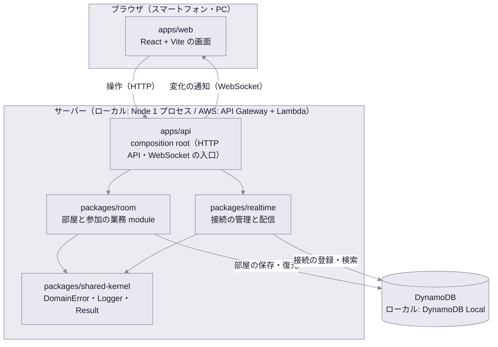

# アーキテクチャ

絵しりとりアプリケーションの層・package の置き場と、使う技術、ローカルと AWS の構成の対応を表す生き資料です。層の責務・依存方向・import 境界の約束は [rules/architecture](../../rules/architecture/standard.md) にあり、ここにはこのプロダクトでの当てはめだけを書きます。

## 全体像

- 画面からの**操作は HTTP**（部屋を作る・入る・開始する）、ほかのメンバーへの**変化の通知は WebSocket**（メンバーが入った・ゲームが始まった）で送ります。理由は「[操作と通知の経路を分ける](#操作と通知の経路を分ける)」にあります
- 業務の判断（満員・ニックネームの重複・開始できるか）は `packages/room` の domain にだけ置きます。`apps/api` は入口と組み立て、`apps/web` は表示だけを持ちます

## package と境界

| 置き場 | 種類 | 責務 | 依存してよい先 |
| --- | --- | --- | --- |
| `packages/shared-kernel` | shared kernel | `DomainError` 基底・`Logger`・`Result` など、module をまたぐ最小限の共通物 | なし |
| `packages/room` | 業務 module | 部屋の作成・参加・ゲームの開始。`domain` `application` `adapters` `errors` を持つ | `shared-kernel` |
| `packages/realtime` | 技術 module | WebSocket の接続の登録・検索と、接続への送信（ローカルと AWS の差し替え口） | `shared-kernel` |
| `packages/api-contract` | API 契約 | OpenAPI specification と、そこから生成する型（HTTP の要求・応答と、WebSocket で送る通知の形） | なし |
| `apps/api` | composition root | HTTP API と WebSocket の入口、adapter の注入。ローカル用の起動口と Lambda 用の起動口を持つ | 上のすべて |
| `apps/web` | presentation | 画面。API 契約の生成型だけに依存する | `api-contract` |
| `tests/` | テスト | HTTP 結合テスト（`tests/integration/`）と E2E（`tests/e2e/`） | `apps/api` の組み立て、各 package の公開 API |

- 後続の移行単位（ターン・お題・描画・回答・しりとり）は、`packages/game` を新設して置く想定です。部屋（誰が集まっているか）とゲーム（いま何が起きているか）は変わる理由が違うため、module を分けます。新設はその移行単位の設計で決めます
- module をまたぐ参照は各 package の公開 entrypoint（`index.ts`）だけにし、import 境界の機械チェック（dependency-cruiser）で検出します

## 技術の選定

| 対象 | 採用 | 捨てた選択肢と理由 |
| --- | --- | --- |
| 言語 | TypeScript（strict）。画面・サーバー・テストで共通 | 画面とサーバーで言語を分けると、API 契約の生成型を共有できない |
| 画面 | React + Vite の SPA | Next.js はサーバー側の実行環境を前提にする機能が多く、静的ファイルとして S3 に置く構成と合わない |
| HTTP サーバー | Hono | Express は Lambda 上で動かすのに別のアダプタが要る。Hono は同じルーティングを Node と Lambda の両方で動かせる |
| WebSocket（ローカル） | `ws` | Socket.IO は独自プロトコルで、AWS の API Gateway WebSocket と同じ形で送受信できない |
| DB | DynamoDB（ローカルは Docker の DynamoDB Local） | 運用の前提（[docs/product](../product/README.md)）。RDB は無料枠で常時起動できない |
| API 契約 | OpenAPI 3.1 + openapi-typescript による型生成 | 型の手書きは規約で禁止（[rules/development](../../rules/development/standard.md) の「API 生成」） |
| テスト | Vitest（単体・結合）、Playwright（E2E）、Storybook（画面の表示状態） | Jest は ESM と TypeScript の設定が別に要り、Vite（画面）と設定を共有できない。Cypress は複数のブラウザを同時に操作する E2E（2 人が同じ部屋に入る）が書きにくい |
| import 境界の検査 | dependency-cruiser | eslint-plugin-boundaries は lint の中で動き、循環依存と `tests/` からの逆向きの import を別の設定で検出することになる。dependency-cruiser は package 境界・循環・禁止配置を 1 つの設定で検出できる |
| ワークスペース | npm workspaces | pnpm・yarn は追加の導入が要り、既存の `npm run check` の入口と揃わない |

## ローカルと AWS の構成の対応

| 役割 | ローカル | AWS（別の要求でデプロイ） |
| --- | --- | --- |
| 画面の配信 | Vite の開発サーバー（`/rooms` と `/ws` を `apps/api` へ中継し、画面は同じオリジンへ要求する） | S3 + CloudFront（API・WebSocket への振り分けはデプロイの要求で決める） |
| 操作（HTTP） | `apps/api` の Node プロセス（Hono） | API Gateway HTTP API + Lambda（同じ Hono アプリ） |
| 通知（WebSocket） | 同じ Node プロセス内の `ws` サーバー | API Gateway WebSocket API + Lambda（接続・切断）と、Management API による送信 |
| DB | DynamoDB Local（Docker） | DynamoDB（オンデマンド） |

- ローカルとの差は、`packages/realtime` の**送信 adapter だけ**に閉じます。接続の登録と検索はどちらも DynamoDB に置くため、「どの接続に何を送るか」の判断はローカルでも AWS と同じ経路を通ります
- ローカルでは送信 adapter が WebSocket の接続の受け入れも持ちます（AWS では API Gateway が受けます）。HTTP サーバーの生成・認証・拒否の応答は `apps/api` が持ちます
- AWS の無料枠: Lambda と DynamoDB には期間の定めのない無料枠があります。一方で API Gateway と CloudFront の無料枠はアカウント作成からの期間に限られ、期間後は使った分の料金がかかります。2025 年 7 月以降に作ったアカウントでは、無料枠がクレジット制に変わっています。費用の見積もりはデプロイの要求で行います

## 設計の判断

### 操作と通知の経路を分ける

画面からの操作はすべて HTTP で受け、WebSocket はサーバーから画面への通知だけに使います。

- 操作を HTTP にすると、要求と応答の形を OpenAPI で定義して生成型で受けられ、結合テストも規約どおり HTTP で書けます（[rules/acceptance-testing](../../rules/acceptance-testing/standard.md)）
- AWS の API Gateway WebSocket は、1 つのメッセージごとに Lambda が起動します。要求と応答を対にする仕組みがないため、操作の結果やエラーを返す経路を自前で作ることになります
- 接続は `?roomCode=&playerToken=` のクエリで本人を確かめます。ブラウザの WebSocket はヘッダーを付けられないためで、AWS の API Gateway WebSocket でも同じ形で接続時に渡せます
- 接続を登録した直後に、いまの部屋を `connected` で本人の接続にだけ送ります。接続と同時に起きた変化を取りこぼさないためです
- 通知は部屋の写しをまるごと送り、プレイヤートークンを含めません。画面は最後に届いた写しを表示するだけで済みます
- 通知は応答を返す前に送り終えます（AWS の Lambda は応答の後の処理を続けられないため）。通知に失敗しても、保存が済んだ操作は成功のまま返します
- 例外として、後続の移行単位で扱う**描画の線**は量が多く 1 秒以内の反映が求められるため、WebSocket で受ける可能性があります。その判断は描画の移行単位の設計で行います

### プレイヤーの識別

ログインはしません（[docs/product](../product/README.md)）。部屋を作る・入るときに、サーバーが推測できない**プレイヤートークン**を発行し、ブラウザに保存させます。以降の操作（開始など）と WebSocket の接続はこのトークンで本人を確かめます。

- トークンはブラウザの `localStorage` に部屋コードごとに保存します。画面の URL は `/`（トップ）と `/r/{部屋コード}`（招待 URL）で、`/r/{部屋コード}` を開いたとき保存済みなら参加画面を出さずに待機室を出します
- 公開されるプレイヤー ID（メンバー一覧に出る）とトークン（本人だけが持つ）を分けます。ID だけで本人とみなすと、ほかのメンバーになりすませるためです
- 同じブラウザで招待 URL を開き直したときに、同じプレイヤーとして待機室に戻す動き（UC-02 要件 10）と、後続の「接続が切れて戻る」は、このトークンで実現します

### データの保存と期限

- 部屋は 1 件の項目として保存し、メンバーの一覧を項目の中に持ちます。部屋が 1 つの集約で、満員・重複・開始の判断を 1 回の読み書きで完結させるためです
- 同時の書き込み（7 人の部屋に 2 人がほぼ同時に入る）は、項目の改訂番号を条件にした書き込みで先着 1 名だけを通します。負けた要求は読み直して判断をやり直し、そこで満員になります
- 最後の更新から 24 時間たった部屋は、**ドメインの判断で「存在しない」として扱い**、物理的な削除は DynamoDB の TTL に任せます。TTL による削除は時刻ちょうどには行われず、DynamoDB Local では行われないため、削除が済んだかどうかを振る舞いの根拠にしません
- 接続は接続表に 1 接続 1 項目で持ち、部屋コードごとにまとめて引けるようにします（通知の宛先は「部屋のメンバー全員」のため）。登録から 24 時間たった項目は TTL が掃除します。送れなかった接続（切れていた接続）は送った側が登録を消します。TTL の削除が済んだかどうかは、部屋と同じく振る舞いの根拠にしません

### 実 DB を使うテストの分離

DynamoDB にはロールバックできるトランザクションがありません。そのため実 DB を使う単体テストも、結合テストと同じく**テストごとに別の部屋コードを使う「データの分割」**で分離します（[rules/testing/project.md](../../rules/testing/project.md) の上書き）。
