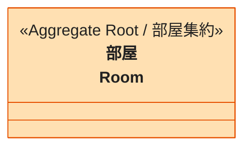

# room パッケージ

部屋を作る・部屋に入る・ゲームを始めるまでを扱うパッケージです。いまは部屋の集約 1 つだけを持ちます。

## 境界一覧

| 境界 | フォルダ | 役割 |
| --- | --- | --- |
| [部屋集約](room-部屋集約.md) | `room/` | 誰が集まっていて、誰がホストで、ゲームが始まったかを持つ |
| [乱数の源](random-乱数の源.md) | `random/` | 部屋コード・プレイヤーの識別子・描く順番を作るときの乱数の入口 |

## 集約俯瞰図

乱数の源は port のため俯瞰図には書かず、[部屋集約](room-部屋集約.md) の詳細図で部屋との関係を示します。

