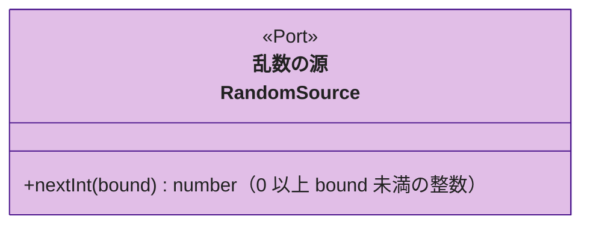

# 乱数の源（random）

部屋コード・プレイヤー識別子・プレイヤートークン・描く順番を作るときに使う、乱数の入口です。

## 詳細図

---

## 乱数の源（RandomSource）

ドメインが乱数を必要とするときの port です。本番の実装は暗号論的に安全な乱数を使う adapter に置き、単体テストでは決まった値を返す実装を渡します。

- **ドメインで乱数を直接読まない。** 部屋コードやトークンを `Math.random` で作ると推測されやすく、また単体テストで値を固定できないため
- **整数 1 つを返す最小の形にする。** 部屋コードの文字の選択も、描く順番の並べ替えも「0 以上 n 未満の整数」から組み立てられる。用途ごとの関数を port に足すと、組み立ての規則（使う文字・並べ替えの方法）がドメインの外の adapter に漏れるため

関数を持たない interface であり、実装クラスの仕様は adapter の単体テストを参照。
