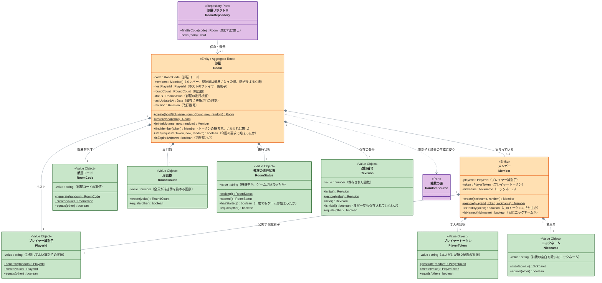

# 部屋集約（room）

誰が部屋に集まっていて、誰がホストで、ゲームが始まったかを持つ集約です。部屋に入れるか（満員・ニックネームの重複・開始済み）と、ゲームを始められるか（ホストか・人数）の判断は、すべてこの集約が行います。

## 詳細図

関数ごとの条件と結果（拒否する条件・エラーコード・境界値）は、各クラスの colocate 単体テスト（`<クラス名>.test.ts` の `describe`）が仕様として持ちます。

---

## 部屋（Room）

部屋に関するすべての判断の入口となる集約ルートです。部屋に入る（`join`）・始める（`start`）は、満員・ニックネームの重複・開始済み・ホストか・人数を、この集約の状態だけで判断します。

- **メンバーを集約の内側に持つ。** メンバーを別の集約にすると、「8 人まで」「同じニックネームは 1 人まで」の判断が複数の集約にまたがり、同時に入ろうとした 2 人を先着順に裁けなくなるため
- **描く順番はメンバーの並びで表す。** ゲームを始めるときにメンバーの並びをランダムに並べ替え、以降は並びがそのまま描く順番になる（UC-03 要件 2）。描く順番を別の値として持つと、メンバーとの食い違い（いない人が順番にいる・いる人が順番にいない）を集約が常に検査することになり、後続の移行単位でメンバーが抜ける・戻るたびに 2 か所を同時に直すことになるため。並べ替えると部屋に入った順は失われるが、それを使うのは後続の移行単位のホストの引き継ぎだけで、その設計で入った時刻をメンバーに持たせる
- **ホストはプレイヤー識別子で指す。** メンバーに「ホストか」の印を持たせると、後続の移行単位でホストを引き継ぐとき（抜ける・接続が切れる）に 2 人のメンバーを同時に書き換えることになるため
- **一度始まったら待機中に戻らない。** 結果画面・再戦後も新しい人を入れない（UC-02 要件 7）ため、進行状態は「一度でも始まったか」で判断する。後続の移行単位で進行状態（ターン中・終了）が増えても、この判断は変えない
- **入れない・始められないは `RoomError`（DomainError）の throw で知らせる。** throw の直前に、判断の原因（部屋コード・人数・ニックネーム）を error のログに出す。値オブジェクトの `create` も、入力が不正なら同じく throw する。use case はこれを捕まえず、API の入口がエラーコードを応答に変える
- **二度目の開始は失敗にしない。** 既に始まった部屋への開始は、何もせず「今回の要求では始まっていない」を返す（UC-03 要件 6）。二度押しや通信の再送でホストにエラーを見せず、順番も決め直さないため
- **期限切れは時刻を受け取って判断する。** `isExpiredAt` は現在時刻を引数で受け取る。集約の中で時刻を読むと、単体テストで期限の前後を作れないため
- **改訂番号を持つ。** 保存の条件（読んだときから誰も書き込んでいないこと）に使う。改訂番号は永続化の都合に見えるが、「同時に入ろうとした 2 人のうち先着 1 人だけが入れる」という業務の約束（UC-02 要件 6）を守る手段なので、集約が持つ
- **最後に更新した時刻は、状態を変えた操作でだけ進める。** 拒否した参加・何もしなかった二度目の開始・状態を読むだけの操作では進めない。保存しない操作で期限を延ばすと、入れない人が試すたびに部屋が残り続けるため
- **ホストかどうかは、開始済みかどうかより先に確かめる。** 二度目の開始を黙って成功にするのはホストの二度押しと再送のためで、メンバーでない人の要求に成功を返さないため

仕様は `Room.test.ts` の `describe` を参照。

---

## メンバー（Member）

部屋に入ったプレイヤー 1 人です。部屋の中で同一性を持ち（同じプレイヤーとして待機室に戻れる）、部屋の外では意味を持たないため、部屋集約の内側の Entity にします。

- **公開する識別子と本人の証明を分ける。** プレイヤー識別子はメンバー一覧として全員に配るので、それだけで本人とみなすとほかのメンバーになりすませる。本人の確認にはプレイヤートークンを使う（[docs/architecture](../../architecture/README.md) の「プレイヤーの識別」）
- **ニックネームの比較はメンバーに尋ねる。** 部屋が `nickname` を取り出して比べると、「同じニックネームとは何か」（前後の空白、ひらがなとカタカナを区別するか）の知識が部屋に漏れるため

仕様は `Member.test.ts` の `describe` を参照。

---

## 部屋コード（RoomCode）

部屋を指す短いコードです。口頭や URL で共有するため、英数字 6 文字の推測されにくい値にします（UC-01 要件 2）。

- **生成と復元を分ける。** 新しい部屋のときだけ乱数から作り（`generate`）、入力された文字列からは検証して作る（`create`）。入力されたコードの書式が誤っていれば、部屋を探す前に「見つからない」と判断できるため
- **大文字と数字だけで作り、入力は大文字小文字・全角半角・前後の空白の違いをそろえて受け付ける。** 口頭やチャットで伝えて手で入れるため。大文字にそろえるのは書式を検証した後にする（先に大文字化すると、英字でない文字が英字に化けて書式を通るため）。全角半角と前後の空白は検証の前にそろえる

仕様は `RoomCode.test.ts` の `describe` を参照。

---

## プレイヤー識別子（PlayerId）

メンバーを指す、全員に公開してよい識別子です。メンバー一覧・ホストの指定に使います。

- ニックネームを識別子にしない。ニックネームは表示のための名乗りで、後続の移行単位で同じ人が別の名前で戻る場面がありうるため
- 復元では書式を検証しない。保存の mapper からしか作らないため

仕様は `PlayerId.test.ts` の `describe` を参照。

---

## プレイヤートークン（PlayerToken）

メンバー本人だけが持つ秘密の値です。部屋を作る・入るときに発行してブラウザに保存させ、開始の要求や待機室へ戻るときの本人確認に使います。

- 関数は生成・復元・等価性だけを持つ。トークンの比較は時間差で中身を推測されないよう、実装で定数時間の比較にする
- **復元では書式を検証しない。** 書式の誤ったトークンは持ち主のいないトークンとして部屋が扱い、「メンバーでない」の判断を 1 か所にするため

仕様は `PlayerToken.test.ts` の `describe` を参照。

---

## ニックネーム（Nickname）

部屋の中でプレイヤーが名乗る名前です。前後の空白を除いた値を持ち、空と長すぎる名前を拒否します（UC-01 要件 4、UC-02 要件 9）。

- **ひらがなとカタカナを別の名前として扱う。** 「はなこ」と「ハナコ」は別人として入れる（UC-02 要件 8）。比較は値の完全一致にする
- 文字の種類は制限しない（UC-01 要件 4）。長さは見た目の文字数（絵文字 1 つを 1 文字）で数える

仕様は `Nickname.test.ts` の `describe` を参照。

---

## 周回数（RoundCount）

全員が描き手を務める回数です。1〜5 の整数だけを受け付けます。

- **既定値を持たない。** 画面は 1 を選んだ状態で表示する（UC-01 要件 3）が、それは画面の初期値であり、部屋は常に指定された周回数で作る。ドメインに既定値を置くと、指定し忘れた要求が黙って 1 周の部屋になるため

仕様は `RoundCount.test.ts` の `describe` を参照。

---

## 部屋の進行状態（RoomStatus）

部屋が待機中か、ゲームが始まったかを表します。外から実値を比べず、`hasStarted` で尋ねます。

仕様は `RoomStatus.test.ts` の `describe` を参照。

---

## 部屋リポジトリ（RoomRepository）

部屋の集約を部屋コードで保存・復元する port です。実装は adapter に置きます。

- **保存は改訂番号を条件にする。** 読んだ後にほかの要求が書き込んでいれば保存は失敗し、use case が読み直して判断をやり直す。リポジトリの中で読み直しをしない。判断をやり直すのは集約の責務であり、リポジトリが業務の判断をしないため
- **新しい部屋は「作るだけ」の条件で保存する。** 改訂番号が初期値の部屋は、同じ部屋コードの項目がまだ無いときだけ書き込める。重なったら（相手が期限切れでも）保存は失敗し、use case が部屋コードを作り直して作成をやり直す。期限切れの部屋への上書きを認めると、上書きしてよいかの判断（期限）を保存の条件に持ち込むことになり、次の項目の「時刻で絞り込まない」と矛盾するため。部屋コードは英数字 6 文字（約 21 億通り）で、期限切れの部屋が削除されずに残る DynamoDB Local でも、作り直しが続くほど重なることは実用上ない
- 期限切れの部屋も復元して返す。「存在しない」とみなすかは use case が `isExpiredAt` で尋ねる。リポジトリが時刻で絞り込むと、期限の判断が adapter に漏れるため
- **改訂番号を進めるのは保存。** 集約は読んだときの改訂番号を持ったまま判断し、保存がそれを条件にして次の値を書く。集約が判断のたびに進めると、保存の条件にする読んだときの値を別に持つことになるため
- **保存の衝突はエラーではなく結果で返す。** 同時の参加と部屋コードの重なりは通常の流れで起き、use case がやり直す合図であって、利用者に返す失敗ではないため

関数を持つ実装クラスの仕様は adapter の単体テストを参照。

---

## 改訂番号（Revision）

部屋が保存された回数です。保存のたびに 1 つ進め、読んだときの値と保存先の値が一致するときだけ書き込めます（部屋リポジトリを参照）。

- **数値のままにしない。** 「まだ一度も保存されていない（新しい部屋）」と「保存済み」で保存の条件が変わるため、その区別を `isInitial` で尋ねられる値にする。数値を外で 0 と比べると、初期値の意味が呼び出し側に散るため
- **復元できるのは 1 以上。** 保存された部屋は少なくとも 1 回保存されており、0 を復元すると新しい部屋と区別できなくなるため

仕様は `Revision.test.ts` の `describe` を参照。

---

## 乱数の源（RandomSource）

[乱数の源](random-乱数の源.md) を参照。部屋集約からは、部屋コード・プレイヤー識別子・プレイヤートークン・描く順番を作るときに使います。
