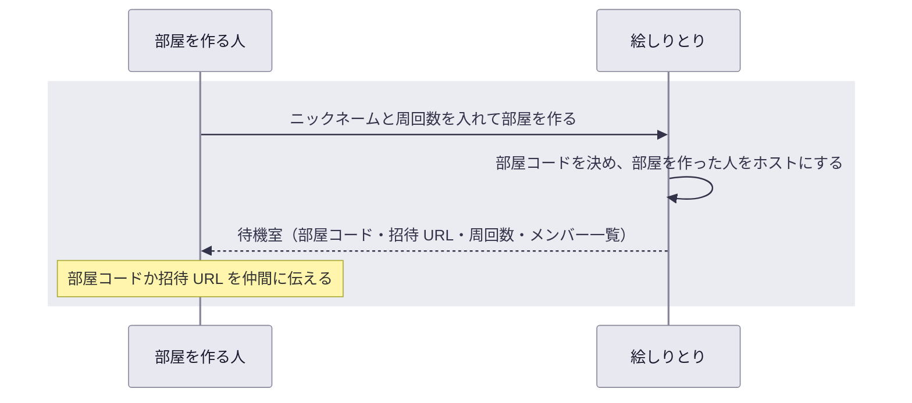

# UC-01 部屋を作って仲間を招く

## 概要

| 項目 | 内容 |
| --- | --- |
| アクター | 部屋を作る人（ホストになる） |
| 目的 | 仲間と遊ぶための部屋を作り、仲間に共有する部屋コードと招待 URL を得る |
| きっかけ | 絵しりとりを遊びたい人がトップ画面を開く |
| 事前条件 | なし（ログインはしない） |
| 要求の経緯 | [REQ-001 / UC-01](../../.designs/REQ-001-eshiritori/UC-01-room/) |

## 動作の全体像

## 正常系の動き

1. 部屋を作る人がトップ画面を開く。部屋を作る欄には、ニックネームの入力欄と、周回数の選択欄が並ぶ
   - **UC-01 要件 3**: 周回数の選択欄は 1〜5 を選べ、最初は 1 が選ばれた状態で表示される
2. ニックネームを入れ、必要なら周回数を変えて、部屋を作る
   - **UC-01 要件 1**: 新しい部屋が作られ、部屋を作った人がホストとしてその部屋の待機室に入る。待機室のメンバー一覧には、部屋を作った人がホストの印つきで表示され、指定した周回数が表示される
3. 待機室で、仲間に伝える部屋コードと招待 URL を確認する
   - **UC-01 要件 2**（未実装）: 待機室に、部屋コード（英数字 6 文字）と、その部屋に直接入れる招待 URL が表示される

## 異常系・境界の動き

- **UC-01 要件 4**: ニックネームが空（空白だけの場合を含む）、または前後の空白を除いて 10 文字を超える場合は、入力の誤りが表示され、部屋は作られない

  ニックネームはメンバー一覧や回答の表示で全員の画面に並ぶため、空の名前では誰か分からず、長すぎる名前はスマートフォンの画面に収まらないためです。文字の種類は制限しません。

- **UC-01 要件 5**: 周回数が 1〜5 の整数でない場合は、入力の誤りが表示され、部屋は作られない

  画面の選択欄は 1〜5 しか選べませんが、それ以外の値が送られた場合も部屋を作りません。周回数はゲームの長さを決め、上限を超えるとゲームが終わらなくなるためです。
