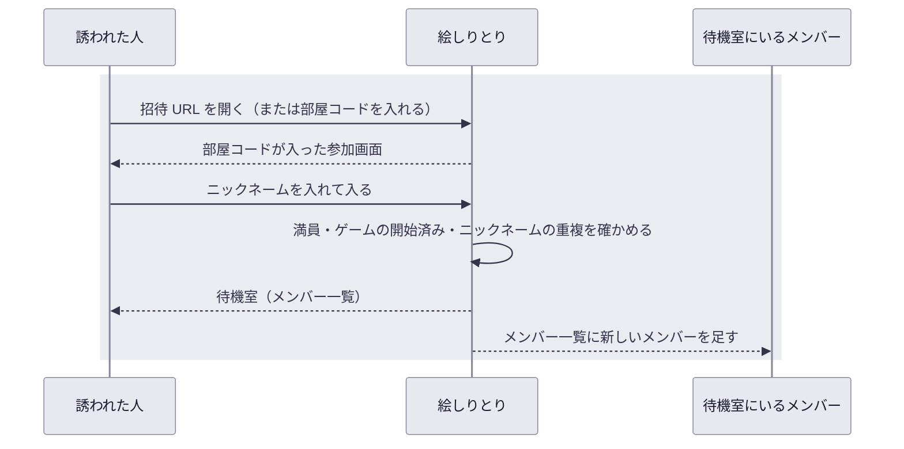

# UC-02 招待された部屋に入る

## 概要

| 項目 | 内容 |
| --- | --- |
| アクター | 誘われた人、待機室にいるメンバー |
| 目的 | 共有された部屋に、アカウントを作らずニックネームだけで入る |
| きっかけ | 誘われた人が招待 URL を開く、または部屋コードを受け取ってトップ画面を開く |
| 事前条件 | 部屋が作られている（[UC-01](UC-01-部屋を作って仲間を招く.md)） |
| 要求の経緯 | [REQ-001 / UC-01](../../.designs/REQ-001-eshiritori/UC-01-room/) |

## 動作の全体像

## 正常系の動き

1. 誘われた人が招待 URL を開く
   - **UC-02 要件 1**（未実装）: 招待 URL を開くと、その部屋の部屋コードが入力済みの参加画面が表示される

   招待 URL ではなく部屋コードを受け取った場合は、トップ画面の部屋に入る欄に部屋コードを入れる。

2. ニックネームを入れて部屋に入る
   - **UC-02 要件 2**: 部屋コードの部屋があり、入れる状態であれば、誘われた人がその部屋のメンバーに加わり、待機室が表示される
3. 待機室にいる全員のメンバー一覧が更新される
   - **UC-02 要件 3**（未実装）: 待機室にいるメンバー全員のメンバー一覧に、新しいメンバーのニックネームが、画面を再読み込みしなくても 1 秒以内に表示される
4. 既にその部屋のメンバーである人が、同じブラウザで招待 URL を開き直した場合
   - **UC-02 要件 10**（未実装）: 参加画面を出さず、同じメンバーとしてその部屋の待機室が表示される。別のメンバーとして二重に加わることはない

## 異常系・境界の動き

- **UC-02 要件 4**: 入力された部屋コードの部屋が無い場合は、部屋が見つからない旨が表示され、メンバーに加わらない

  打ち間違いと、作られていない部屋を区別せずに伝えます。どちらでも、誘った人に部屋コードを確かめ直すことになるためです。

- **UC-02 要件 5**: 最後に操作があってから 24 時間たった部屋は、部屋が無い場合と同じく見つからない旨が表示される

  遊び終わった部屋の記録を長く残さないためです（[docs/product](../product/README.md) の「運用の前提」）。

- **UC-02 要件 6**: 部屋のメンバーが既に 8 人いる場合は、満員である旨が表示され、メンバーに加わらない。7 人の部屋に 2 人がほぼ同時に入ろうとした場合は、先に届いた 1 人だけが加わり、もう 1 人には満員である旨が表示される

  1 部屋 8 人までに収めるのは、全員の名前と得点をスマートフォンの画面に並べきるためです。同時に入ろうとした場合も上限を超えません。

- **UC-02 要件 7**: その部屋で一度でもゲームが始まっている場合（ゲーム中・結果画面・再戦後を含む）は、ゲーム中のため入れない旨が表示され、メンバーに加わらない

  ゲームの途中で人が増えると、描く順番と周回数が全員に平等でなくなるためです。

- **UC-02 要件 8**: 同じ部屋のメンバーに同じニックネームの人がいる場合は、別のニックネームを求める旨が表示され、メンバーに加わらない。前後の空白は除いて比べ、ひらがなとカタカナの違い（「はなこ」と「ハナコ」）は別のニックネームとして扱う

  回答や正解の表示はニックネームで誰かを示すため、同じ名前が 2 人いると区別できないためです。

- **UC-02 要件 9**: ニックネームが空（空白だけの場合を含む）、または前後の空白を除いて 10 文字を超える場合は、入力の誤りが表示され、メンバーに加わらない

  理由は [UC-01 要件 4](UC-01-部屋を作って仲間を招く.md) と同じです。
