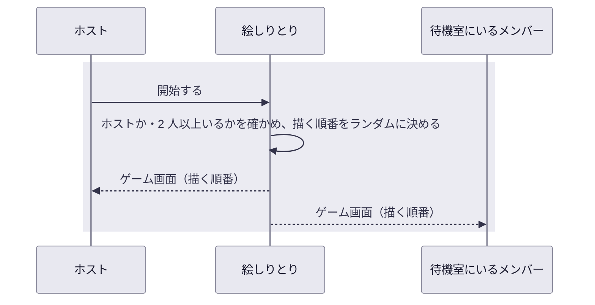

# UC-03 ゲームを始める

## 概要

| 項目 | 内容 |
| --- | --- |
| アクター | ホスト（部屋を作った人）、待機室にいるメンバー |
| 目的 | メンバーがそろったところで、全員同時にゲームを始め、描く順番を知る |
| きっかけ | ホストが、待機室に仲間がそろったのを見る |
| 事前条件 | ホストが待機室にいる（[UC-01](UC-01-部屋を作って仲間を招く.md)） |
| 要求の経緯 | [REQ-001 / UC-01](../../.designs/REQ-001-eshiritori/UC-01-room/) |

## 動作の全体像

## 正常系の動き

1. 待機室で、ホストの画面にだけ開始の操作が表示される
   - **UC-03 要件 1**（未実装）: 待機室では、ホストの画面にだけ「開始」の操作が表示され、ホスト以外のメンバーの画面にはホストが開始するのを待っている旨が表示される
2. ホストが、メンバーが 2 人以上いる状態で開始する
   - **UC-03 要件 2**（未実装）: 描く順番がランダムに決まり、メンバー全員の画面が 1 秒以内にゲーム画面に切り替わる
3. 全員が描く順番を確認する
   - **UC-03 要件 3**（未実装）: メンバー全員のゲーム画面に、同じ並びの描く順番が表示される

## 異常系・境界の動き

- **UC-03 要件 4**（未実装）: メンバーがホスト 1 人だけの場合は、開始できず、2 人以上で始められる旨が表示される

  描き手 1 人と当てる人 1 人がいないとゲームが成り立たないためです。

- **UC-03 要件 5**（未実装）: ホスト以外のメンバーからの開始の要求は受け付けない

  画面ではホスト以外に開始の操作を出しませんが、画面を経由しない要求でも始まらないようにします。全員がそろったかを判断するのは、仲間を誘ったホストだからです。

- **UC-03 要件 6**（未実装）: 既にゲームが始まった部屋への開始の要求（ホストの二度押し・通信の再送）は無視され、描く順番は決め直されず、エラーも表示されない

  開始を押したホストに、押せたかどうか不安にさせる表示を出さないためです。順番を決め直すと、既にゲーム画面を見ているメンバーと食い違うためです。
